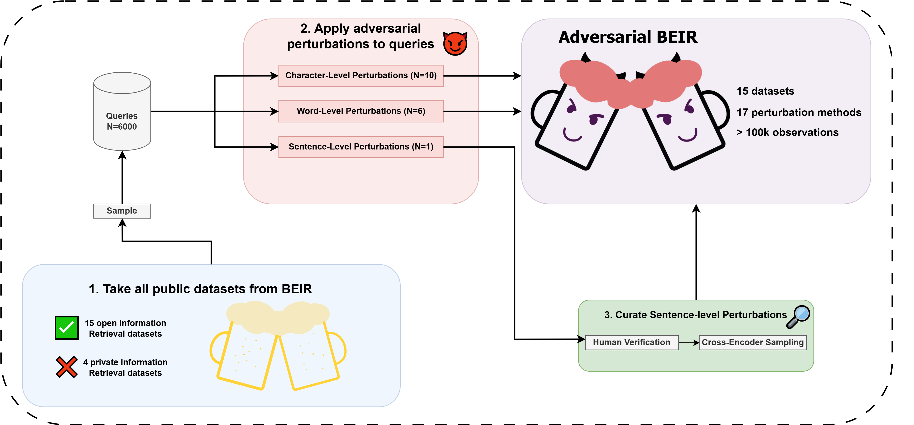

# Adversarial BEIR
<h2>Benchmarking Information Retrieval Models Against Query Perturbations</h2>


## Introduction
Welcome to the repository of Adversarial BEIR! We've built it to standardize the process of evaluating retrieval models against query perturbations. The following sections describe how to obtain the data and evaluate your own model on adversarial queries.

## Obtaining the adversarial examples
In order to get the entire perturbed BEIR, navigate to the root directory of the repository and run the following:
```bash
./get_perturbed_beir.sh
```
> This script will create a virtual environment, install requirements, and download BEIR data too, so if you decide to run it, you can skip the "First steps" section.

Datasets for which we could share modification of observations are located in `data/perturbed_beir_datasets/` directory. Each directory with the perturbed dataset contains its own `LICENSE` file. Please follow the terms of those licenses. <br>

We also share the results of human annotation. Observations from specific datasets with labels created by annotators are located in `data/annotated_beir_dataset` directory. If a paraphrase was selected for the final benchmark based on its ranking score, then the value of `selected` column for this row is equal to `True`.  

We were unable to publish all perturbed datasets from BEIR due to non-permissive or missing licenses. We could not share following datasets:
- TREC-COVID
- NFCorpus
- FiQA-2018
- Quora
- Climate-Fever

These datasets will be downloaded and query perturbations will be applied on your side using the provided script.
Note that this process is significantly faster when you are using a GPU (or other accelerator) with cuda 
installed, since some perturbations use transformer models under the hood. 

## First steps
### Create a virtual environment
```bash
virtualenv -p python3 venv_name 
```

### Install requirements
```bash 
pip install -r requirements.txt
```

### Download datasets from BEIR
Every public dataset from [BEIR benchmark](https://github.com/beir-cellar/beir) will be downloaded and placed in `data/beir_datasets`.
```bash 
./download_all_beir_datasets.py
```

## How to evaluate?
We provide handy scripts with which you can evaluate your retriever. Right now, there is a possibility to evaluate Dense Retrievers. However, we plan to introduce new types of evaluation in the near future.

Scripts use [Sentence Transformers](https://sbert.net/) to load the retriever and [faiss](https://github.com/facebookresearch/faiss) to prepare and index with embeddings.

All you need to run the script is a single `yaml` config. We present the config required to evaluate the model on original dataset from BEIR in `configs/beir_evaluation_config.yaml`. 

The config required to run evaluation on AdversarialBEIR should look as follows:

```yaml
---
benchmark_path: "data/perturbed_beir_datasets/scifact/perturbed_scifact.json" # replace this with the benchmark file obtained in the previous section
model_path: "intfloat/e5-small" # HuggingFace path to your retriever
use_prompt: False # True if model uses a prompt, instructions prompts that we use for specific datasets are placed in data/instructions.json
instruct_prefix: "" # some models utilize additional instruct prefix, e.g. "Instruct: ", leave empty if your model does not use that
query_prefix: "query: " # prefix added before each query
passage_prefix: "passage: " # prefix added before each passage
batch_size: 64 # batch size used while encoding queries/passages
use_cache: False # if True, the index with passage embeddings is saved in cache and used later without running expensive encoding again
```

> You can use 10 prepared and perturbed datasets located in `data/perturbed_beir_datasets/` as benchmark files (without having to run the script from "Obtaining the adversarial examples" section. 

Index with embeddings of passages for specific dataset is saved in `.cache` by default. If you would like to save these indices in a specific place, define `INDICES_CACHE_DIR` environmental variable.

Now everything is ready for evaluation, navigate to the root directory of the repository and run the following:

### Evaluate AdversarialBEIR
```bash
export PYTHONPATH=$(pwd)
export CUDA_VISIBLE_DEVICES=0
python src/evaluate_benchmark.py --config_path <path_to_config>
```

### Evaluate original BEIR dataset
```bash
export PYTHONPATH=$(pwd)
export CUDA_VISIBLE_DEVICES=0
python src/evaluate_beir_dataset.py --config_path <path_to_config>
```

## Disclaimer
Please note that the paraphrases from the `Automatic Paraphrase` (`sentences_paraphrase` in our code) perturbation method come from [X-ALMA](https://huggingface.co/collections/haoranxu/x-alma-66fde464ef90be465920abaa) and [Qwen](https://huggingface.co/collections/Qwen/qwen25-66e81a666513e518adb90d9e) models. You should first read the licenses of these models before using these data for your purposes.

We distribute the modified queries only for datasets for which the license allows it. However, it is the user's responsibility to ensure they have the appropriate permissions to use the dataset under its license and to properly cite the dataset's owner. We do not guarantee the quality or fairness of the datasets, nor do we claim that you have the license to use them.

Like the authors of [BEIR](https://github.com/beir-cellar/beir), we encourage authors of other information retrieval datasets to post an issue if you would like to include your dataset in our benchmark.

If you are an author of a dataset and would like to modify it / do not want it to be included in our benchmark - feel free to contact us or to fill an issue.
